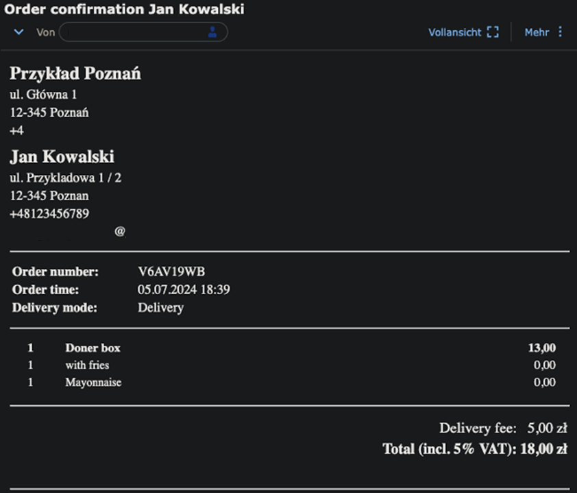
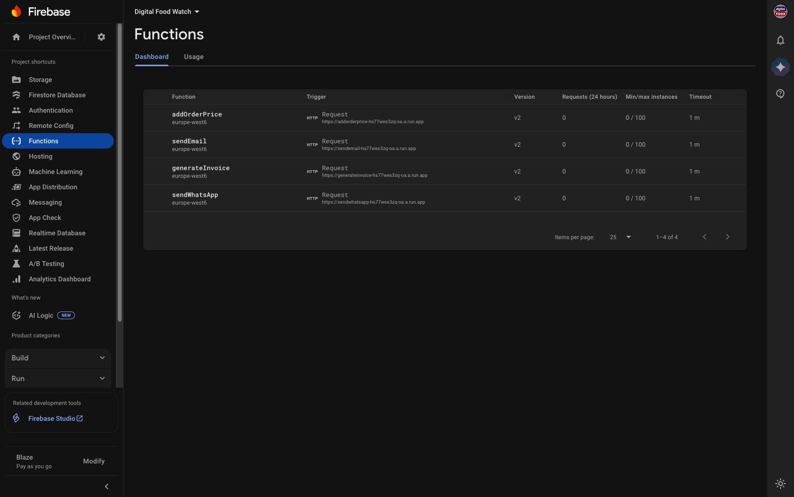

# Functions

This Node.js program, written in JavaScript, contains functions hosted in Google Functions so that email and WhatsApp order confirmations can be sent to the customer and restaurant and the cumulated order price can be updated. The endpoints are used by the smartwatch apps.

## Confirmations

Below are examples of how the order confirmations look like. Restaurant and client each receive a copy.

### Email order confirmation

### WhatsApp order confirmation

## Hosting

1. Install gcloud CLI and open your command prompt / terminal
2. Go to the `functions` subfolder
3. Run `gcloud functions deploy --project=your-project --region=europe-west6 sendEmail --runtime nodejs20 --trigger-http --allow-unauthenticated`, adjusting the region and project name to your needs and replacing the runtime with the most recent one.
   * You can gather the projects with "gcloud projects list", then set the project id you see with "gcloud config set project PROJECT_ID".
   * The --allow-unauthenticated is very important. Without that, email confirmations won't be sent and there won't even be any error in the Log Explorer, because the request to the Cloud Function is simply rejected. You won't necessarily be prompted with "(y/N)" for that flag in the terminal at all, so you have to think of including it yourself.

The hosted functions should look like the following in your Firebase console.

## Remarks

When in doubt if a modification works, deploy it to a different name first and test it there.

While there is no zero-downtime deployment yet, choose a time for the deployment when restaurants are closed in order to avoid downtime.

For multiple projects, make sure you deploy the functions to the right one by setting up your gcloud to use the correct project: https://cloud.google.com/sdk/gcloud/reference/config/set